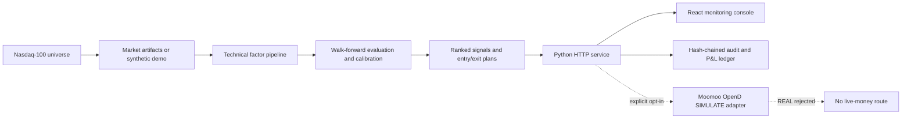

# Aegis Forecast

**A privacy-safe, simulation-only Nasdaq-100 quantitative research
workstation.**

**Created and maintained by
[LAI ZEYU](https://github.com/lzy2767865503-pixel).**

Aegis Forecast combines a Python research engine, deterministic technical
factor ranking, walk-forward model evaluation, a React monitoring console,
hash-chained audit records and an optional Moomoo OpenD simulation adapter.
Real-money execution is permanently rejected in code.

> Research software only. The bundled dataset is synthetic, the displayed
> results are not investment advice, and no return or accuracy is guaranteed.


## What makes this repository reproducible

- A fresh clone starts with deterministic synthetic artifacts and does not
  require a brokerage account.
- Broker data, account snapshots, orders, positions, logs, databases,
  credentials and personal documents are excluded from version control.
- Simulation execution is disabled by default and requires an explicit
  environment flag.
- CI verifies Python 3.10 and 3.12, deterministic fixtures, unit tests,
  frontend compilation and a live HTTP smoke test.
- The same commands used locally are documented and run in GitHub Actions.

## Product capabilities

- **Nasdaq-100 universe layer** - frozen public constituent snapshot with an
  official-source synchronizer and duplicate-security validation.
- **Pure technical ranking** - trend, momentum, relative strength,
  price-volume, market structure and volatility/risk-quality factors.
- **Evidence-aware model evaluation** - purged walk-forward framing,
  probability calibration, minimum-sample gates, transaction-cost assumptions
  and explicit refusal to claim an edge when the confidence bound fails.
- **Decision plans** - breakout and pullback entries, ATR-based invalidation,
  staged exits, trailing stops, time stops and per-name intraday simulation
  bands.
- **Simulation broker boundary** - US-symbol allowlist, `SIMULATE` environment
  enforcement, masked identifiers and no credential handling.
- **Operational observability** - autonomous heartbeat, P&L ledger, daily /
  weekly / monthly / yearly aggregation, model-health views and data
  provenance.
- **Model governance** - Champion/Challenger registry, shadow evaluation,
  human approval and rollback-oriented audit evidence.
- **Tamper evidence** - SHA-256 chained audit events for model, data and
  simulated execution decisions.

## Architecture



## Quick start

Prerequisites:

- Python 3.10+
- Node.js 20+
- pnpm 10+

```bash
git clone https://github.com/lzy2767865503-pixel/aegis-forecast.git
cd aegis-forecast
./scripts/setup.sh
./scripts/run.sh
```

Open [http://127.0.0.1:8766](http://127.0.0.1:8766).

On macOS, `run_aegis_a.command` provides the same safe local startup flow.

## Verify the entire stack

```bash
./scripts/verify.sh
```

The verification gate checks:

1. deterministic demo artifacts are current;
2. Python unit and safety-boundary tests pass;
3. the React production build succeeds;
4. a temporary local server returns healthy API, signal and HTML responses;
5. simulation execution remains disabled.

## Optional Moomoo simulation integration

The public demo does not need Moomoo. To connect your own OpenD simulation
environment:

```bash
./scripts/setup.sh --with-moomoo
cp .env.example .env
```

Keep OpenD on `127.0.0.1:11111`. Credentials and trade-unlock secrets stay
inside OpenD; this application never accepts them.

Read-only account monitoring works when OpenD is available. Automated
simulation execution remains off unless the operator deliberately sets:

```bash
export AEGIS_ENABLE_SIMULATION_EXECUTION=1
```

Even with that flag, the adapter rejects any environment other than
`SIMULATE`. There is no real-money implementation.

## Repository map

```text
backend/aegis_quant/   HTTP service, broker boundary, audit, P&L and governance
technical_model/      factor engineering, scoring and walk-forward evaluation
frontend/             React/Vite monitoring console
config/               universe and model policy
demo_data/            deterministic synthetic artifacts
scripts/              setup, run, fixture generation and full verification
tests/                unit, safety-boundary and reproducibility tests
docs/                 architecture, model card, privacy and operating limits
```

## Engineering boundaries

- Localhost only by default; do not expose this HTTP service directly to the
  internet.
- Demo metrics are illustrative and cannot support investment claims.
- The repository does not redistribute broker-derived market history.
- Nasdaq-100 membership changes over time; the committed universe is a
  reproducible snapshot, not a promise of current membership.
- Model “self-learning” means governed offline evaluation, never runtime code
  rewriting or automatic promotion into live trading.

See [Architecture](docs/ARCHITECTURE.md),
[Model Card](docs/MODEL_CARD.md),
[Reproducibility](docs/REPRODUCIBILITY.md) and
[Privacy](docs/PRIVACY.md).

## Author

Designed, engineered and published by
[LAI ZEYU](https://github.com/lzy2767865503-pixel).

## License

MIT
