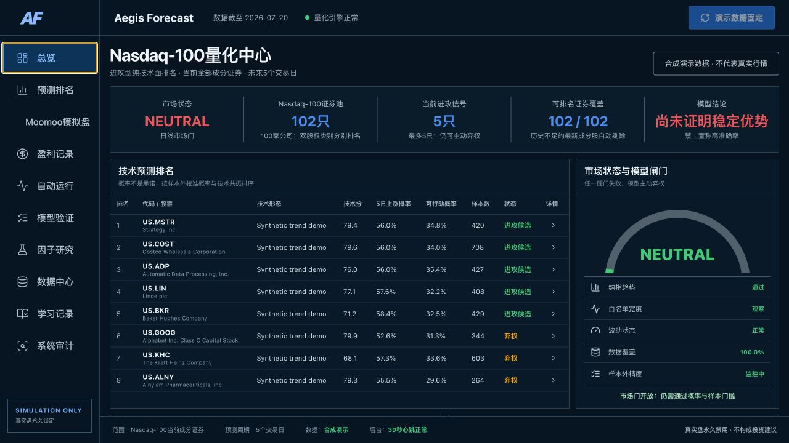
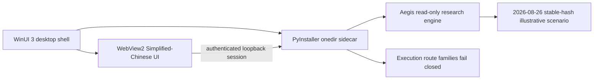

# Quant Scenario Studio by LAI ZEYU

**Windows Store Read-Only Edition of the Aegis Forecast research engine.**

Quant Scenario Studio is a local, Simplified-Chinese Nasdaq-100 scenario
research and education application. Store version 1.5.0 uses the official
Nasdaq-100 constituent snapshot dated **2026-08-26** and deterministic synthetic
values. It does not display live or latest market data.

> Deterministic synthetic demo only. Not market data, investment advice, an
> order tool or a promise of future performance.

Created and maintained by
[LAI ZEYU（来泽宇）](https://github.com/lzy2767865503-pixel). The Store
visible `PublisherDisplayName` is separately fixed to **LAI ZEYU**. Partner
Center's non-visible package Name is injected only after reservation, and its
technical Publisher is this account's GUID-form CN—not an author signature. The
repository and internal engine retain the historical name **Aegis Forecast**.



## Store boundary

- The Store package contains no brokerage SDK, account connector, transaction
  implementation, scheduler, legacy execution module or private-data pipeline.
- `WINDOWS_STORE_READ_ONLY` is compiled into the runtime. REAL, LIVE and
  SIMULATE execution paths receive a fail-closed HTTP 403 response.
- The package always loads the bundled deterministic synthetic artifacts. An
  environment variable cannot switch it to private or market data.
- The sidecar binds only to loopback and requires a fresh per-process session,
  same-origin requests and CSRF protection for mutations.
- There is no telemetry, cloud account, remote data endpoint, advertising ID or
  background network service.
- App-owned settings, integrity checks and audit evidence use marker-bound
  package LocalState. In-app deletion requires the exact ownership binding and
  removes only allowlisted app paths.

## Product capabilities

- Nasdaq-100 **2026-08-26** constituent snapshot (100 companies, 102 securities);
- stable-hash deterministic synthetic factor-ranking and illustrative scenarios;
- neutral confirmation, reference, invalidation and sensitivity thresholds;
- runtime metrics recalculated from all 300 shipped illustrative rows;
- local file-integrity checks and SHA-256 chained audit evidence;
- privacy notice and allowlisted deletion of local application state.

## Architecture



Windows application state is stored only after the package LocalState path and
PFN binding supplied by `ApplicationData.Current.LocalFolder` are recorded in
an app ownership marker. Install resources remain read-only. See
[Architecture](docs/ARCHITECTURE.md).

## Source verification

Reference toolchain:

- Python `3.13.14` (`.python-version`; official Windows x64 build)
- Node.js `22.23.1` (`.nvmrc`)
- pnpm `10.34.5`
- .NET SDK `8.0.424` (`global.json`)

```bash
corepack enable
corepack prepare pnpm@10.34.5 --activate
./scripts/setup.sh
./scripts/verify.sh
```

Windows packaging and certification commands are documented in
[packaging/windows/README.md](packaging/windows/README.md). PyInstaller is not a
cross-compiler: an x64 MSIX and Windows App Certification Kit result must be
produced on Windows.

## Repository map

```text
backend/aegis_quant/   Store sidecar, policy, privacy and research APIs
technical_model/      source research algorithms (not all enter Store package)
frontend/             React/Vite WebView2 console
desktop/windows/      WinUI 3 lifecycle shell and MSIX manifest
packaging/windows/    Store-only PyInstaller spec and legal inventory
scripts/windows/      candidate build, two-round native QA and evidence scripts
config/               bundled read-only snapshot and research policy
demo_data/            deterministic synthetic artifacts dated 2026-08-26
tests/                reproducibility, API, deletion and fail-closed tests
docs/windows/          Store listing, privacy, certification and release runbook
```

## License

MIT. The MSIX includes `Legal/LICENSE.txt`, `Legal/THIRD_PARTY_NOTICES.md` and
the upstream dependency license inventory.

## Windows distribution boundaries

- Microsoft Store verification is owner-dispatched (and may only be rerun by
  that same owner) from the exact protected `main` commit. One unsigned
  Partner Center MSIX is built, copied once, and only the temporary QA copy is
  signed with the ephemeral technical-Publisher certificate. Exact payload-tree
  equivalence is proved before nonce-bound QA twice and complete bounded WACK
  twice on the unchanged QA-copy bytes. Only the original unsigned submission,
  checksum and non-secret lineage JSON are retained under an exact ACL on a
  pre-provisioned local fixed-NTFS handoff root on that runner; the QA copy,
  certificate and detailed evidence are deleted and no Store package is ever
  uploaded to GitHub.
- GitHub distribution is a separate portable ZIP. The protected manual workflow
  gives the checkout/sign/test job read-only repository permission. After CKA
  unload, certificate removal and hash-bound silent uninstall, it hands only the tested ZIP/checksum to a separate write-only,
  no-checkout publisher. Every recursively discovered PE must have exactly one
  SHA-256/RFC 3161 signature index from the same publicly trusted signer whose
  SimpleName is exactly `LAI ZEYU` or `来泽宇`. The publisher uses a unique
  per-run marker and exact Release ID for upload/publication, re-downloads and
  revalidates private and public bytes, and restores only its immutable
  ID/node-ID/creation-time-bound object to draft if any later gate fails.
